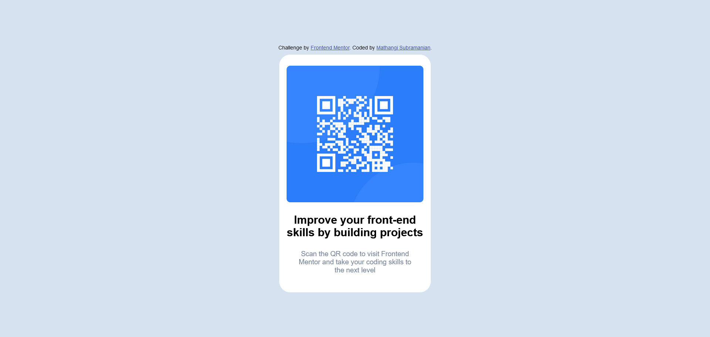
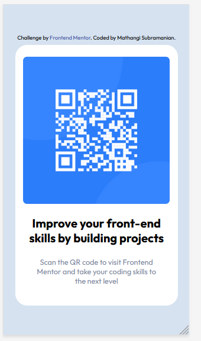

# Frontend Mentor - QR code component solution

This is a solution to the [QR code component challenge on Frontend Mentor](https://www.frontendmentor.io/challenges/qr-code-component-iux_sIO_H). The challenge involves building a QR code component and get it looking as close to the design as possible.

## Table of contents

- [Overview](#overview)
  - [Screenshot](#screenshot)
  - [Links](#links)
- [My process](#my-process)
  - [Built with](#built-with)
  - [What I learned](#what-i-learned)
  - [Continued development](#continued-development)
  - [Useful resources](#useful-resources)
- [Author](#author)
- [Acknowledgments](#acknowledgments)

## Overview
### Screenshot

### 
Desktop view
 

### 
Mobile View
 

# 
### Links

- Solution URL : https://github.com/mathangisd/qr-code-component.git 
- Live URL : [QR code component](https://qa-code-component.netlify.app/)

## My process
### Built with

- Semantic HTML5 markup
- CSS custom properties
- CSS Grid

### What I learned

A great first project to get started with html and css. I was able to practice grid properties, css custom properties and understand how to use width and max-width properties. I also learned to write a README page and how to host on Netlify. 

### Continued-Development
I would like to keep working on other projects that would involve CSS grid, CSS flexbox and different responsive layouts.

### Useful resources

[HTML and CSS course](https://www.youtube.com/watch?v=-8ORfgUa8ow&list=PLnHJACx3NwAdT_8forzXYvx0o4A2VnoHX) - by amazing instructor [John Smilga](https://johnsmilga.com/) - This course helped me understand many basics of HTML and CSS.

[Different ways to center a div on a page](https://dev.to/abthakur/different-ways-to-center-a-div-in-a-webpage-5enn) - Ayushman Bilas Thakur: This link was useful in showing the different ways to center a div.

## Author
- Website - [Mathangi Subramanian](https://github.com/mathangisd)
- Frontend Mentor - [mathangisd](https://www.frontendmentor.io/profile/mathangisd)

## Acknowledgments
I was able to understand many concepts from [John Smilga's](https://johnsmilga.com/) projects. 
I was able to get some ideas on how to organize the README page from [Aviral Sharma](https://github.com/aviralsharma07/QR-code-component) and [Alex Fernández](https://github.com/Arekkusu17/QR-code-component-challenge#overview).

Thank you to anyone for giving any feedback, it is always helpful to know how the code could be improved.