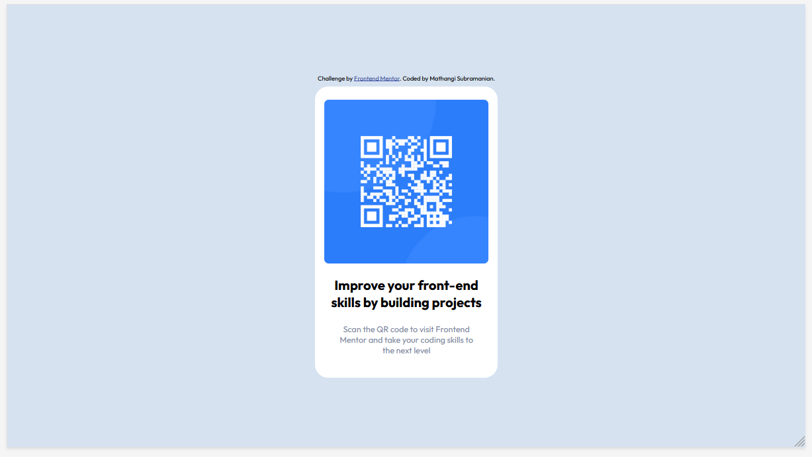

# Frontend Mentor - QR code component solution

This is a solution to the [QR code component challenge on Frontend Mentor](https://www.frontendmentor.io/challenges/qr-code-component-iux_sIO_H).

[Solution](https://github.com/mathangisd/Frontend-Mentor-Challenges/tree/main/qr-code-component-main) | [Live](https://your-live-site-url.com)

### 
---
### 
**Desktop View**
 

---
### 
**Mobile View**
 

## Built with

- Semantic HTML5 markup
- CSS custom properties
- CSS Grid

## What I learned

A great first project to get started with html and css. I was able to practice grid properties and understand how to use width and max-width. 
